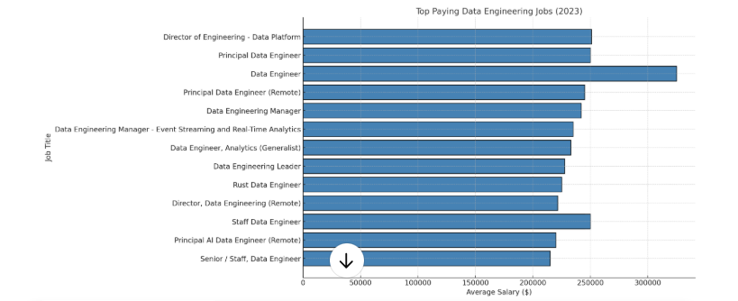

# Navigating the Data Engineering Job Market💰
This project helps you understand the data engineering job market, focusing on high-paying roles, in-demand skills, and the sweet spot where high demand meets high salary.  💡💡

Explore the SQL queries used in this project: [project_sql folder](/project_sql/)
# Why This Project?
This project started because I wanted to better understand the data engineering job market.  The goal was to identify the top-paying jobs and the skills needed to get them, ultimately making it easier for everyone to find the best opportunities.

The data comes from the [SQL Course](https://lukebarousse.com/sql). and includes information about job titles, salaries, locations, and required skills.

### Key Questions Explored

I used SQL queries to answer these important questions:

1. What are the top-paying jobs for my role?
2. What are the skills required to these top-paying roles?
3. What are the most in-demand skills for my role?
4. What are the top skills based on salary for my role?
5. What are the most optimal skills to learn?
      Optimal: High Demand AND High Paying
# Tools of the Trade
My data engineering job market analysis relied on these tools:

- **SQL**: The foundation of my analysis, used to query the job data and extract key insights.
- **PostgreSQL**: The database system I used to manage and work with the job posting data.
- **Visual Studio Code**: My primary tool for database management and running SQL queries.
- **Git & GitHub**: Essential for version control, sharing my SQL scripts and analysis, and tracking project progress.
# Analysis and Insights
**My Analysis Approach**

Each SQL query in this project was designed to explore a specific facet of the data engineering job market. Here's a breakdown of my approach for each key question:

### 1. Identifying Top-Paying Data Engineering Jobs
To pinpoint the highest-paying roles, I filtered data engineering positions based on average yearly salary and location. I specifically focused on remote positions to highlight opportunities with high earning potential that offer location flexibility.  This query revealed which data engineering specializations command the highest salaries.

```sql
SELECT
      job_id,
      name AS company_name,
      job_title,
      job_location,
      job_schedule_type,
      salary_year_avg,
      job_posted_date
FROM
      job_postings_fact
LEFT JOIN company_dim ON job_postings_fact.company_id = company_dim.company_id
WHERE
      job_title_short = 'Data Engineer' AND
      job_location = 'Anywhere' AND
      salary_year_avg IS NOT NULL
ORDER BY
      salary_year_avg DESC
LIMIT 20
```

High Salaries for Data Engineers:

The highest-paying role listed is for Data Engineers at Engtal, offering $325,000 per year.
The top-paying jobs range from $215,000 to $325,000, indicating strong demand for senior-level data engineers.
Leadership & Specialized Roles Pay More:

Director, Principal, and Staff Data Engineer roles dominate the list, highlighting that experience and leadership skills significantly impact salary.
Example: "Director of Engineering - Data Platform" at Twitch ($251,000) and "Principal AI Data Engineer at Grindr ($220,000)".
Big Tech & Startups Offer Competitive Pay:

Companies like Meta, Twitch, and AI startups are offering some of the highest salaries, showing that both established tech giants and startups are willing to pay top dollar for data engineering talent.
Meta has three job listings on the list, all paying above $230,000.
Full-Time, Remote Work is Common:

All jobs listed are full-time and location-independent, emphasizing the flexibility and high demand for remote data engineering roles.
Emerging Technologies Matter:

Companies hiring for Rust, AI, and Streaming Analytics show a shift towards real-time data processing, AI-driven analytics, and new programming paradigms.
Example: "Rust Data Engineer" at Understanding Recruitment ($225,000) and "Event Streaming and Real-Time Analytics" role at LTK ($235,000).



*Bar graph visualizing the salary for the top 20 salaries for data engineering; ChatGPT generated this graph from my SQL results*
# Key Takeaways

- Focusing on cloud data engineering skills is crucial for maximizing earning potential in the current market.
- While SQL remains essential, expanding your skillset to include cloud platforms and big data technologies is highly recommended.
- Networking and building a strong portfolio of data engineering projects can significantly improve job prospects.
# Final Thoughts
This project significantly improved my SQL skills and provided valuable insights into the data engineering job market. The analysis findings offer a practical roadmap for prioritizing skill development and focusing job search efforts. By concentrating on high-demand, high-salary skills, aspiring data engineers can gain a competitive edge in the job market.

This exploration underscores the importance of continuous learning and staying current with the evolving trends in data engineering.  It demonstrates how targeted data analysis can inform career decisions and maximize opportunities in this dynamic field.